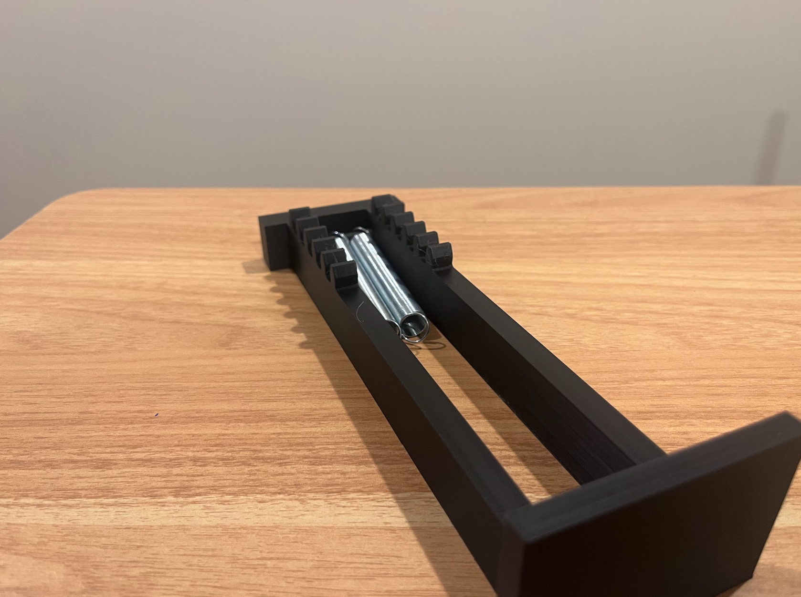
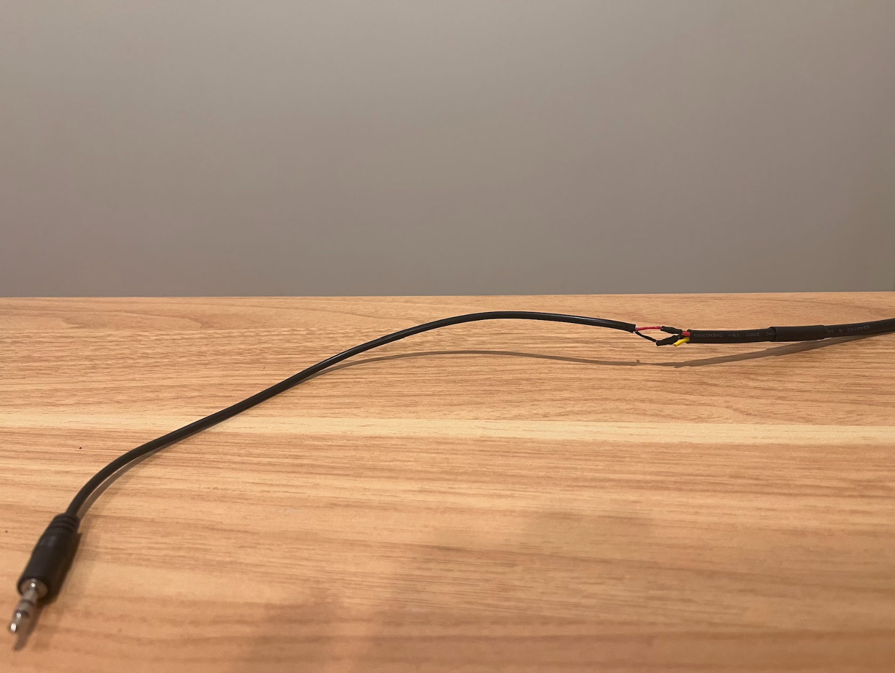

## Media Gallery

### Completed Project
Here are some photos of the finished launcher, both on its own and attached to a wheelchair.

<table>
  <tr>
    <td align="center">
      
       wheelchair-soccer-launcher-front.png
    </td>
    <td align="center">
      
       wheelchair-soccer-launcher-side.png
    </td>
    <td align="center">
      
       launcher-attached-to-wheelchair.png
    </td>
  </tr>
</table>

### Videos
Here are some videos demonstrating the launcher's functionality.

**Launching a Ball**
<video width="100%" controls>
  <source src="{{ site.baseurl }}/videos/launching-ball.mp4" type="video/mp4">
  Your browser does not support the video tag.
</video>

**Testing Launcher Controls**
<video width="100%" controls>
  <source src="{{ site.baseurl }}/videos/testing-launcher-switches.mp4" type="video/mp4">
  Your browser does not support the video tag.
</video>

### Assembly Pictures
This gallery contains various pictures taken during the assembly process, showing close-ups of specific components and steps.

<table>
  <tr>
    <td align="center">
      
       3d-printed-components.png
    </td>
    <td align="center">
      
       aluminum-extrusion-pvc-connection.png
    </td>
    <td align="center">
      
       assembled-launch-button.png
    </td>
  </tr>
  <tr>
    <td align="center">
      
       assembled-motor-gear.png
    </td>
    <td align="center">
      
       assembled-plunger.png
    </td>
    <td align="center">
      
       attached-casing.png
    </td>
  </tr>
  <tr>
    <td align="center">
      
       attaching-launcher-base-to-cart.png
    </td>
    <td align="center">
      
       battery-case-drill-locations.png
    </td>
    <td align="center">
      
       breaking-in-axles.png
    </td>
  </tr>
  <tr>
    <td align="center">
      
       breaking-in-gears.png
    </td>
    <td align="center">
      
       breaking-in-hex-axle.png
    </td>
    <td align="center">
      
       breaking-in-plunger.png
    </td>
  </tr>
  <tr>
    <td align="center">
      
       cart-arm.png
    </td>
    <td align="center">
      
       cart-wheel.png
    </td>
    <td align="center">
      
       casing-drill-locations.png
    </td>
  </tr>
  <tr>
    <td align="center">
      
       electronics-base-drill-locations.png
    </td>
    <td align="center">
      
       full-cart-assembly.png
    </td>
    <td align="center">
      
       launch-button-cable.png
    </td>
  </tr>
  <tr>
    <td align="center">
      
       launch-button-electronics.png
    </td>
    <td align="center">
      
       launch-button.png
    </td>
    <td align="center">
      
       launcher-base-bottom.png
    </td>
  </tr>
  <tr>
    <td align="center">
      
       launcher-base-drill-locations.png
    </td>
    <td align="center">
      
       launcher-base-with-plunger.png
    </td>
    <td align="center">
      
       launcher-circuit.png
    </td>
  </tr>
  <tr>
    <td align="center">
      
       main-cart-frame-design.png
    </td>
    <td align="center">
      
       main-control-board.png
    </td>
    <td align="center">
      
       mounted-batteries.png
    </td>
  </tr>
  <tr>
    <td align="center">
      
       mounted-battery-case.png
    </td>
    <td align="center">
      
       mounted-control-board.png
    </td>
    <td align="center">
      
       mounted-electronics-base.png
    </td>
  </tr>
  <tr>
    <td align="center">
      
       mounted-hex-shaft.png
    </td>
    <td align="center">
      
       mounted-motor-gear.png
    </td>
    <td align="center">
      
       mounted-pawl.png
    </td>
  </tr>
  <tr>
    <td align="center">
      
       mounting-limit-switch.png
    </td>
    <td align="center">
      
       mounting-motor.png
    </td>
    <td align="center">
      
       pvc-drill-locations.png
    </td>
  </tr>
  <tr>
    <td align="center">
      
       testing-electronics.png
    </td>
    <td align="center">
      
       wheelchair-grip.png
    </td>
    <td align="center">
      
       wiring-casing.png
    </td>
  </tr>
  <tr>
    <td align="center">
      
       wiring-l298n.png
    </td>
    <td align="center">
      
       wiring-pico.png
    </td>
    <td align="center">
    </td>
  </tr>
</table>
